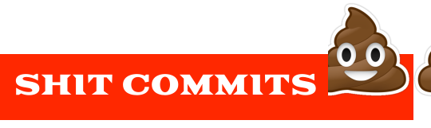

<b>
   Commit your code with shitty commit messages. 💩 
   </b>
</b>

> ⚠️ Note : Don't use this on your serious projects as it commits the swear words which you probably don't want.

## Context

I have habit of typing random commit messages when things go wrong for me so, I created this CLI so you can have fun. Fetches the messages from [whatthecommit](http://whatthecommit.com/).

## Reference 
- [what-the-commit](https://www.npmjs.com/package/what-the-commit)