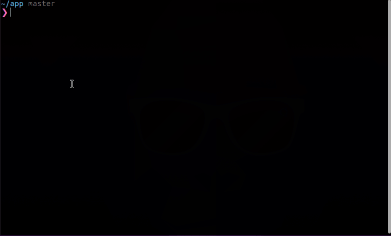

<p align="center">

</p>

<p align="center">
<a href="https://www.npmjs.org/package/shitcommits"></a>
<a href="https://www.npmjs.org/package/shitcommits"></a>
<a href="https://www.npmjs.org/package/shitcommits"></a>

</p>

<p align="center">
<b>
   A perfect commit message doesn't exi-. 💩 
   </b>
</b>

<p align="center">

</p>

> ⚠️ Note : Don't use this on your serious projects as it commits the swear words which you probably don't want.

## Installation

Make sure you have [Node.js](https://nodejs.org/) installed in your machine.

```bash
$ npm install -g shitcommits
```

or,

```bash
$ sudo npm install -g shitcommits
```

## Usage

Go to your project directory, open terminal or other CLI and type

```
$ shit
```

This will automatically stage the file and add commit those with random messages.

Make sure to initialize the git repository using `git init` before running command.

## Context

I have habit of typing random commit messages when things go wrong for me so, I created this CLI so you can have fun that the messages from [whatthecommit](http://whatthecommit.com/).

## Other Commands

- Help

```
$ shit --help
```

- Check version

```shit
$ shit --version
```

## Reference

- [what-the-commit](https://www.npmjs.com/package/what-the-commit)

## Release Notes

Read [Change Log](CHANGELOG.md) for complete logs.

## Contributing

You can [raise issues](https://github.com/adarshaacharya/shitcommits/issues) or check [Contributing Guide](CONTRIBUTING.md) if you love to have some of your contributions to this project.

## Show your support

Give a ⭐️ if you like the project! :tada:

## Author

- Website: <https://adarshaacharya.com.np/>
- Twitter: [@aadarshatweets](https://twitter.com/aadarshatweets)
- Github: [@adarshaacharya](https://github.com/adarshaacharya)
- LinkedIn: [@adarshaacharya](https://linkedin.com/in/adarshaacharya)

## License

Copyright © 2021 [Aadarsha Acharya](http://adarshaacharya.com.np/).<br />
This project is [MIT](https://github.com/adarshaacharya/shitcommits/blob/master/LICENSE) licensed.
